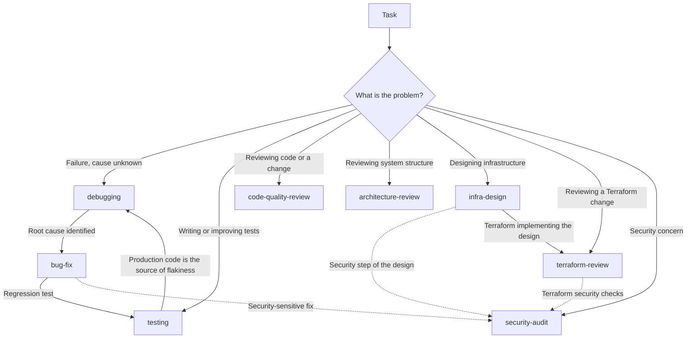

# Claude Code Configuration

My personal [Claude Code](https://claude.com/claude-code) setup — global engineering guidelines, reusable skills, commands, and output styles, versioned so it can be restored on any machine.

It lives at `~/.claude`, where Claude Code also stores runtime state such as sessions, history, caches, and credentials. `.gitignore` therefore uses a whitelist: everything is ignored by default, and only durable configuration is tracked.

## Quick start

If you're new to Claude Code configuration, you only need to understand three things:

- **`CLAUDE.md`** — rules Claude always follows.
- **Skills** — reusable workflows Claude selects when a task matches.
- **Commands** — workflows you explicitly invoke with `/name`.

You usually **do not need to invoke skills manually**. Describe the task naturally and Claude should select the appropriate skill.

For example:

```text
> Our checkout endpoint returns 500 when the cart is empty.
> Reproduce the issue, find the root cause, fix it, and add a regression test.
```

Claude should route the work through the appropriate workflow:

```text
debugging → bug-fix → testing
```

### Which skill should I use?

| If you are... | Use |
|---|---|
| Investigating a failure with an unknown cause | `debugging` |
| Fixing a confirmed bug | `bug-fix` |
| Writing or improving tests | `testing` |
| Reviewing a code change | `code-quality-review` |
| Reviewing system architecture | `architecture-review` |
| Reviewing security | `security-audit` |
| Designing infrastructure | `infra-design` |
| Reviewing Terraform/OpenTofu | `terraform-review` |

Commands are different:

```text
Skills   → Claude decides when to use them.
Commands → You explicitly invoke them.
```

For example:

```text
"Fix this authentication bug"
→ Claude can select the appropriate skill.

"/review-changes"
→ Explicitly invokes the review command.
```

## How it works

The configuration is layered so each rule has one clear owner:

```text
Your task
    ↓
CLAUDE.md
    ↓
Claude matches a skill
    ↓
SKILL.md is loaded
    ↓
The workflow is applied
    ↓
Another skill may take over when its boundary is reached
```

Instructions live in layers; **the narrowest layer that can own a rule, owns it**.

| Layer | Holds | Loaded |
|---|---|---|
| `CLAUDE.md` | Global engineering behavior | Always |
| `skills/` | Reusable workflows for specific tasks | On demand |
| `commands/` | Explicit entry points | When `/name` is invoked |
| `output-styles/` | Response format and tone | When activated |
| `.claude/` in a project | Project-specific knowledge | Always in that project |

Project instructions take precedence over global instructions.

The separation keeps context lean: workflow detail loads only when relevant, and reusable workflows can evolve without changing global engineering behavior.

## Repository structure

```text
~/.claude/
├── CLAUDE.md         # global engineering guidelines
├── skills/           # reusable workflows, loaded on demand
│   └── <name>/SKILL.md
├── commands/         # slash commands
│   └── <name>.md
├── output-styles/    # reusable response styles
│   └── <name>.md
├── scripts/          # repository checks
│   ├── check-config.sh   # deterministic drift audit (runs in CI)
│   └── eval-triggers.sh  # behavioral skill-routing eval (manual)
├── .github/          # CI configuration
├── README.md         # overview and adoption guide
├── CONTRIBUTING.md   # extension and contribution rules
└── LICENSE
```

Everything else — including Claude Code runtime state and `settings.json` — is deliberately untracked.

`settings.json` contains personal preferences such as plugins, theme, and model settings, and Claude Code may rewrite it automatically. Versioning it would therefore create noisy, machine-specific changes.

For adding skills, commands, output styles, or other tracked configuration, see [CONTRIBUTING.md](CONTRIBUTING.md).

## Design philosophy

The configuration follows a simple rule:

> **Each rule has exactly one home.**

Global behavior belongs in `CLAUDE.md`.

Reusable task workflows belong in `skills/`.

Explicit entry points belong in `commands/`.

Response formatting belongs in `output-styles/`.

Project-specific behavior belongs in the project's `.claude/`.

This avoids duplicated instructions, keeps context smaller, and makes ownership clear.

## Skills

Claude discovers skills by reading each `SKILL.md`'s `description`. The frontmatter description is the skill's routing signal.

| Skill | Reviews / produces | Use when |
|---|---|---|
| `debugging` | an unknown cause | Investigating intermittent failures, unexplained traces, or failures with no known trigger |
| `bug-fix` | a defect | Fixing a confirmed bug — reproduce, root-cause, fix minimally, add a regression test |
| `testing` | tests | Writing or improving tests, or fixing flaky tests |
| `code-quality-review` | a change | Reviewing a diff or branch for readability and maintainability |
| `architecture-review` | the system | Assessing module boundaries, coupling, layering, and structural debt |
| `security-audit` | trust boundaries | Reviewing security concerns, authentication, authorization, secrets, or input handling |
| `infra-design` | a design | Designing infrastructure — simplest design first, complexity only when a requirement justifies it |
| `terraform-review` | an IaC change | Reviewing Terraform/OpenTofu changes and plans for blast radius, state safety, and drift |

Skills are named after the **work**, not the worker. Review skills use the `<subject>-review` convention.

### Skill boundaries

Skills intentionally have narrow responsibilities.



Skills combine where responsibilities overlap.

For example, a security-sensitive bug fix can use both `bug-fix` and `security-audit`, while `bug-fix` can hand the regression-test work to `testing`.

Each skill's `Scope` section defines its exact boundary.

The guiding rule is:

> **When two skills could apply equally, neither reliably does.**

## Commands

Commands are thin entry points, not alternative skill implementations.

A command exists only when it does something a skill cannot — for example, binding a scope up front, running repository-specific setup, or providing a deterministic explicit entry point.

| Command | Does | Invokes |
|---|---|---|
| `/review-changes` | Resolves the diff to review and reviews it read-only | `code-quality-review` |
| `/add-skill` | Scaffolds a skill and updates the required repository documentation | — |
| `/check-config` | Audits the repository for configuration drift | — |

Most skills intentionally have no command because their descriptions already provide enough information for Claude to select them automatically.

## Output styles

`output-styles/` contains reusable response styles.

A style controls **how Claude responds**, not how engineering work is performed.

```text
Skills         → what work Claude performs
Commands       → how you explicitly invoke a workflow
Output styles  → how the response is presented
```

`concise` is the preferred style: short, direct responses that lead with the result.

## Validation

The repository uses two levels of validation.

### Mechanical validation

`scripts/check-config.sh` checks rules that can be determined reliably without an LLM, including:

- skill whitelist synchronization
- skill frontmatter
- README skill-table membership
- README skill-boundary diagram membership
- configuration structure

CI runs this check on every push.

Run it locally:

```bash
bash scripts/check-config.sh
```

### Behavioral validation

`scripts/eval-triggers.sh` evaluates whether skill descriptions route representative tasks to the intended skill.

It is deliberately **not run in CI** because it:

- requires the Claude CLI
- consumes model tokens
- is non-deterministic
- is intended to catch routing regressions rather than repository structure errors

Run it before a release or after changing skill descriptions:

```bash
bash scripts/eval-triggers.sh
```

For a stricter stability check:

```bash
EVAL_RUNS=3 EVAL_MODEL=haiku bash scripts/eval-triggers.sh
```

## Adopting this config

### Just the skills

Each skill is self-contained:

```bash
git clone https://github.com/thixpin/claude-config.git /tmp/claude-config
cp -r /tmp/claude-config/skills/bug-fix ~/.claude/skills/
```

Copy related skills together when their `Scope` sections describe handoffs between them.

For example:

```bash
cp -r /tmp/claude-config/skills/debugging ~/.claude/skills/
cp -r /tmp/claude-config/skills/bug-fix ~/.claude/skills/
cp -r /tmp/claude-config/skills/testing ~/.claude/skills/
```

### Just an output style

An output style is one self-contained file:

```bash
cp /tmp/claude-config/output-styles/concise.md ~/.claude/output-styles/
```

### The whole config

Clone the repository directly:

```bash
git clone https://github.com/thixpin/claude-config.git ~/.claude
```

If `~/.claude` already exists, do not overwrite it blindly. Back up any existing configuration first.

You can initialize the existing directory as a Git repository instead:

```bash
cd ~/.claude
git init -b master
git remote add origin https://github.com/thixpin/claude-config.git
git fetch origin
git checkout -f master
```

> **Warning:** `git checkout -f master` overwrites conflicting tracked files. Back up customized `CLAUDE.md`, skills, commands, or other configuration before running it.

### LSP

The navigation guidelines in `CLAUDE.md` prefer LSP-based navigation when available.

Enable an LSP plugin for the languages you work with — TypeScript, Go, Python, PHP, Rust, and so on.

LSP is not required. The navigation rules fall back to text search when LSP is unavailable.

## Extending the configuration

You do not need to understand the repository internals to start using it.

When you want to extend the configuration:

1. Add a skill, command, or output style according to [CONTRIBUTING.md](CONTRIBUTING.md).
2. Run the mechanical validation.
3. Run the behavioral trigger evaluation when changing skill descriptions.
4. Review the diff.
5. Commit only when ready.

See [CONTRIBUTING.md](CONTRIBUTING.md) for the detailed rules.

## Third-party skills

Third-party skills are external instruction sources that run with the same trust as your own configuration — review them before installing.

Before installing one:

1. Read its `SKILL.md`.
2. Review what instructions it adds.
3. Prefer a reviewed commit rather than tracking a moving branch.
4. Read `SKILL.md` again after updates.

Third-party skills remain independent projects with their own names and licenses.

## License

[MIT](LICENSE) © Soe Thura

Third-party skills installed under `skills/` remain separate projects under their respective licenses.