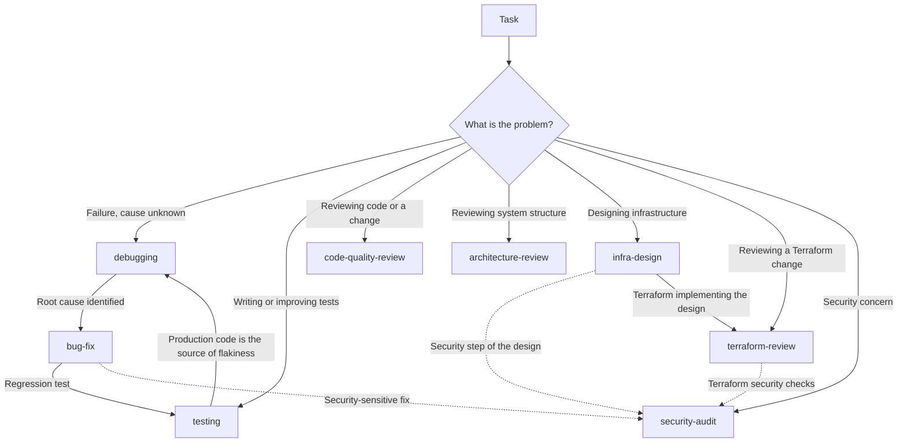

# Claude Code Configuration

My personal [Claude Code](https://claude.com/claude-code) setup — global engineering guidelines, reusable skills, the commands that invoke them, and output styles, versioned so it can be restored on any machine ([adoption](#adopting-this-config)). It lives at `~/.claude`, where Claude Code also writes runtime state (sessions, history, caches, credentials) — so `.gitignore` is a whitelist: everything is ignored by default, only durable configuration is tracked.

## Design philosophy

Instructions live in layers; **the narrowest layer that can own a rule, owns it**.

| Layer                     | Holds                                                       | Loaded                         |
| ------------------------- | ----------------------------------------------------------- | ------------------------------ |
| `CLAUDE.md` (this repo)   | Global engineering behavior, for any codebase               | Always                         |
| `skills/` (this repo)     | Reusable workflows for one kind of task                     | On demand, when a task matches |
| `commands/` (this repo)   | Explicit entry points for scoped workflows or repository operations | When you type `/name`          |
| `output-styles/` (this repo) | Response format and tone, never methodology              | When activated with `/output-style` |
| `.claude/` (each project) | Project-specific knowledge: stack, commands, conventions    | Always, in that project        |

Project instructions override global ones. Each rule has exactly one home: workflow detail loads only when it matches, and workflows evolve without touching global behavior. `CLAUDE.md` holds only global engineering behavior; workflows belong in `skills/`; a command carries no methodology of its own.

## Repository structure

```
~/.claude/
├── CLAUDE.md         # global engineering guidelines (always loaded)
├── skills/           # reusable workflows, loaded on demand
│   └── <name>/SKILL.md
├── commands/         # slash commands, invoked explicitly
│   └── <name>.md
├── output-styles/    # response styles, activated with /output-style
│   └── <name>.md
├── scripts/          # deterministic audit, run locally or by CI
│   └── check-config.sh
├── .github/          # CI: runs scripts/check-config.sh on every push
├── README.md
├── CONTRIBUTING.md   # how to add skills, commands, and output styles
└── LICENSE
```

Everything else — runtime state, and `settings.json`, which Claude Code rewrites on settings changes — is deliberately untracked.

To add skills, commands, output styles, or top-level paths, see [CONTRIBUTING.md](CONTRIBUTING.md); `scripts/check-config.sh` verifies the mechanical rules, and CI runs it on every push.

## Skills

Claude discovers skills by reading each `SKILL.md`'s `description` and invokes one when a task matches — the frontmatter is the only registry.

| Skill                 | Reviews / produces | Use when                                                        |
| --------------------- | ------------------ | ---------------------------------------------------------------- |
| `debugging`           | an unknown cause   | Investigating a mystery — intermittent failures, unexplained traces, no known trigger |
| `bug-fix`             | a defect           | Fixing a bug — reproduce first, root-cause, fix minimally, add a regression test |
| `testing`             | tests              | Writing or improving tests; fixing flaky tests                    |
| `code-quality-review` | a change           | Reviewing a diff or branch for readability and maintainability     |
| `architecture-review` | the system         | Assessing structure, module boundaries, coupling; planning a refactor |
| `security-audit`      | trust boundaries   | Security review, fixing a vulnerability, hardening auth or input handling |
| `infra-design`        | a design           | Designing or proposing infrastructure — simplest design first, complexity only when a requirement justifies it |
| `terraform-review`    | an IaC change      | Reviewing a Terraform/OpenTofu plan or diff — blast radius, state safety, drift before apply |

Third-party skills install as clones into `skills/` — untracked, updated with `git pull`, under their upstream name and license. A skill is trusted instructions: read a third-party `SKILL.md` before installing and after every pull, and prefer pinning to a reviewed commit over tracking a branch.

### Skill boundaries



Skills combine where responsibilities overlap — a security-sensitive fix applies both `bug-fix` and `security-audit`. The diagram shows the handoffs; each skill's `Scope` section states the exact boundary.

## Commands

Commands are thin entry points, not methodology. One exists only when it does something a skill cannot — bind a scope by running git up front, act on this repository itself, or be invoked deterministically — and it names the skill it delegates to without copying that skill's checklist.

| Command          | Does                                                          | Invokes               |
| ---------------- | ------------------------------------------------------------- | --------------------- |
| `/review-changes` | Resolves the diff to review (argument, uncommitted, or branch) and reviews it read-only | `code-quality-review` |
| `/add-skill`     | Scaffolds `skills/<name>/SKILL.md`, whitelists it, adds the README row | —                     |
| `/check-config`  | Audits this repo for drift: dropped skills, stale README, layer violations | —                     |

No other skill has a command, deliberately: they trigger reliably from their own descriptions and have no scope to pre-bind; `/review`, `/code-review`, `/security-review`, `/init`, and `/run` are built in; and skills route to each other through their `Scope` sections.

## Output styles

`output-styles/` holds response styles, activated with `/output-style <name>`. A style controls format and tone only — methodology stays in `CLAUDE.md` and `skills/`. `concise` is the preferred style: short, direct responses that lead with the result.

## Adopting this config

**Just the skills** — each directory is self-contained:

```bash
git clone https://github.com/thixpin/claude-config.git /tmp/claude-config
cp -r /tmp/claude-config/skills/bug-fix ~/.claude/skills/
```

Skills name each other in their `Scope` sections — copy related ones together. `commands/review-changes.md` pairs with `code-quality-review`; `add-skill` and `check-config` assume this repository's layout and are not portable on their own.

**Just an output style** — one self-contained file:

```bash
cp /tmp/claude-config/output-styles/concise.md ~/.claude/output-styles/
```

**The whole config** — follow the setup below. `settings.json` is not included; Claude Code manages your own. `CLAUDE.md`'s Navigation guidelines prefer LSP, so enable an LSP plugin for your languages; they fall back to text search without one, or trim those lines from `CLAUDE.md` if you don't want LSP at all.

## Setup on a new machine

```bash
git clone https://github.com/thixpin/claude-config.git ~/.claude
```

If `~/.claude` already exists (Claude Code creates it on first run), initialize in place instead of cloning over it:

```bash
cd ~/.claude
git init -b master
git remote add origin https://github.com/thixpin/claude-config.git
git fetch origin
git checkout -f master
```

`checkout -f` overwrites local files that conflict with tracked paths — back up any customized `CLAUDE.md` or skills first.

## License

[MIT](LICENSE) © Soe Thura. Third-party skills installed under `skills/` are separate projects under their own licenses — see their repositories.
